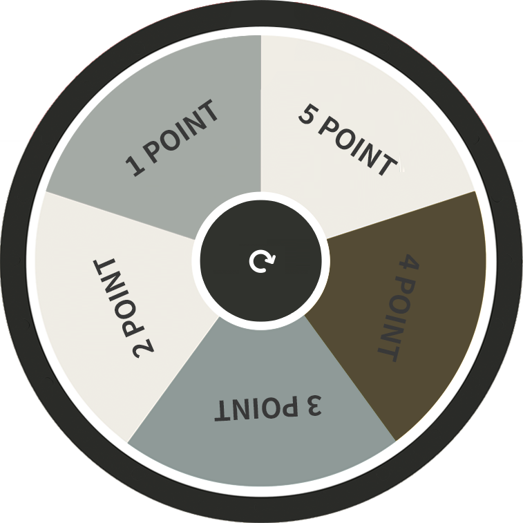
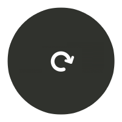

# Roulette-jqueryRotate.js
jQueryRotate.js 를 사용한 크로스 브라우징 대응 
룰렛 이벤트
<br><br>
  
<br>

```html
<div class="roulette_wrap">
	<div class="roulette_form">
		
		<a href="javascript:gameStart();" class="trigger"></a>
		<span class="pin"></span>
	</div>
</div>
```
```css
.roulette_wrap {position:relative; width:500px;}
.roulette_wrap img {width:100%;}

.roulette_form {position:relative;}
.roulette_form .trigger {position:absolute; left:50%; top:50%; transform:translate(-50%, -50%); width:27%;}
.roulette_form .pin {position:absolute; left:50%; top:8.5%; transform:translate(-50%, -50%); width:11%;}
```

```javascript
var flag = true;

function gameStart(){
	var pieceCnt = 5; //상품갯수
	var percentage = new Array; //랜덤 숫자
	var percentageVal = [50, 20, 10, 10, 10]; //당첨확률 12시 기준 반시계방향 순
	// 0(5) = 50%
	// 1 = 20%
	// 2 = 10%
	// 3 = 10%
	// 4 = 10%
	
	var winningArr = new Array; //랜덤수 * 확률

	for (k=0; k<pieceCnt; k++){
		percentage[k] = Math.floor(Math.random()*10)+1;
		for (j=0; j<=k-1; j++){
			while(percentage[k] == percentage[j]){
				percentage[k] = Math.floor(Math.random()*10)+1;
			};
		};
	};

	for (i=0; i<pieceCnt; i++){
		winningArr[i] = percentage[i] / percentageVal[i]
	};

	//max
	//var maxVal = Math.max.apply(null, winningArr);
	//var maxValIdx = winningArr.indexOf(maxVal);
	//var winning = maxValIdx;

	//min
	var minVal = Math.min.apply(null, winningArr);
	var minValIdx = winningArr.indexOf(minVal);
	var winning = minValIdx;

	var rotation = (15 + parseInt(Math.random() * 6)) * 360;
	var winAngle = (360 / pieceCnt * (winning-1) + 5) + Math.random() * (360 / pieceCnt - 10);

	if (flag){
		flag = false;
		$('.roulettePanel').rotate({
			angle: 0,
			animateTo: rotation + winAngle,
			duration: 3000,
			easing: $.easing.easeOutQuint
			,callback: function(){ 
				if (winning == 0){
					alert('5 당첨');
				} else{
					alert( winning+'당첨' );
				}
				flag = true;
			}
		});

		console.log(winning);
	}
};
```
